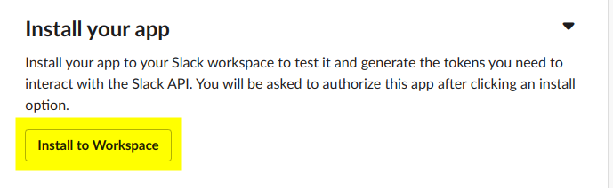

# Demo Slack Bot app

## When the app is installed and finished you should be able to see something like this.


## Required software
* gnu make
* terraform
* tfswitch
* docker
* docker-compose


# Pre Setup (making this your own)
## Terraform
edit [./tf/main.tf](./tf/main.tf) and adjust the region in the aws provider
block .

## Edit config.sjon
edit [./config.json](./config.json) and adjust the values as needed


## Initialize Environment

### Set your AWS REGION and UID (for docker layer generation)
```
export AWS_REGION="us-east-x"
export UID="$(id -u)"
```

### Poetry
`poetry upgrade`

## Run terraform
```
cd ./tf
tfswitch
terraform init
terraform plan -out plan.out
terraform apply plan.out
```

## initialize a blank ssm secret
```
./bin/crypt.sh create
```

## perform first deploy of of backend (needed to create slack app manifest)
```
make deploy_all
```

## Generate slack manifest
```
make  gen_slack_manifest
```

## Setup Slack App
* Create two channels in your workspace, one as a primary channel for your app,
    and another for exceptions the application may throw (for monitoring)
    * 

* Navigate to the slack apps [page](https://api.slack.com/apps/)
* Select "Create New App"
    * 
* Select "Create App from Manifest"
    

* Select your desired workspace
    * 

* Copy the text in `./slack/manifest.yaml` generated from the previous command,
    and past into the window
    * 

* Finalize your app creation
    * 

* Click "Install to Workspace"
    * 

* Authorize App, and select your primary channel you created in a previous step
    * 

* Go to "Incoming Webhooks" and click "Add New Webhook to workspace"
    * 

* Select the exception webhook you created earlier
    * 

* Edit your .secrets.json file, and populate with values from the various parts
of the application. You secrets json file should look like the first image.
    * 
    * 
    * 
    * 

* Once all these are updated save the file and issue the command
    *
```
./bin/crypt.sh save
```

* Once they are saved, go your "App Manifest" section, and click the verify
location
    * 

* At this point you should be done, save your source control, and follow the
steps below to maintain / update the application.


## Maintenance

# Deploy instructions

## Serverless

### updating / adding packages
```
## Upgrade existing packages
poetry upgrade

## add new direct packages (will be in layer)
poetry add xyz

## Add development package
poetry add -D foo
```

### Deploying layer changes
```
make deploy_all
```

### Deploying only code changes
```
make deploy_only_serverless
```

## Tailing logs
```
# Tail lambda web
make logs
```

## Updating Terraform

```
cd ./tf
terraform plan -out plan.out
terraform apply plan.out
```
